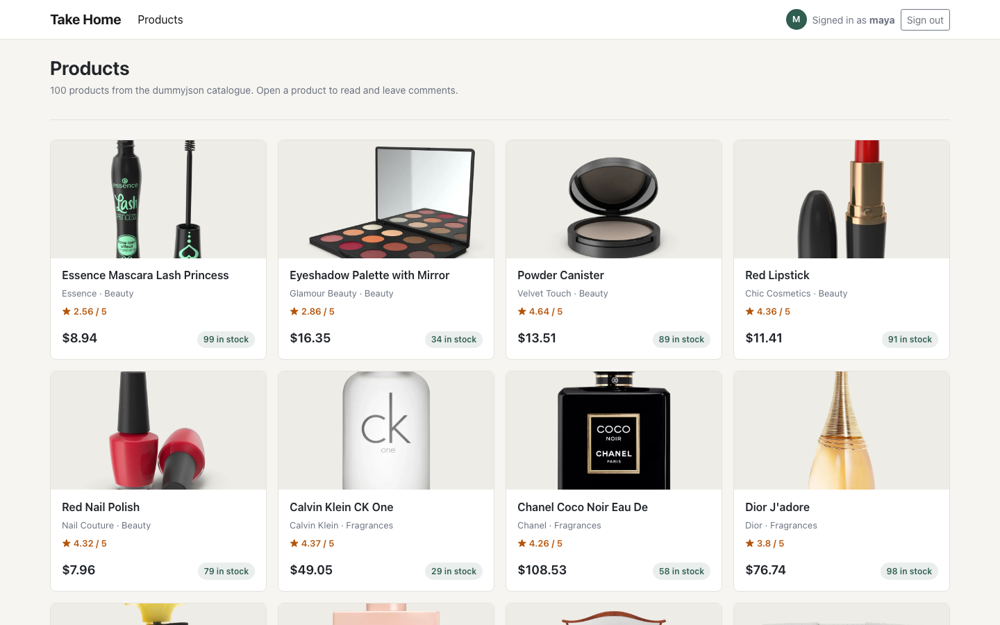
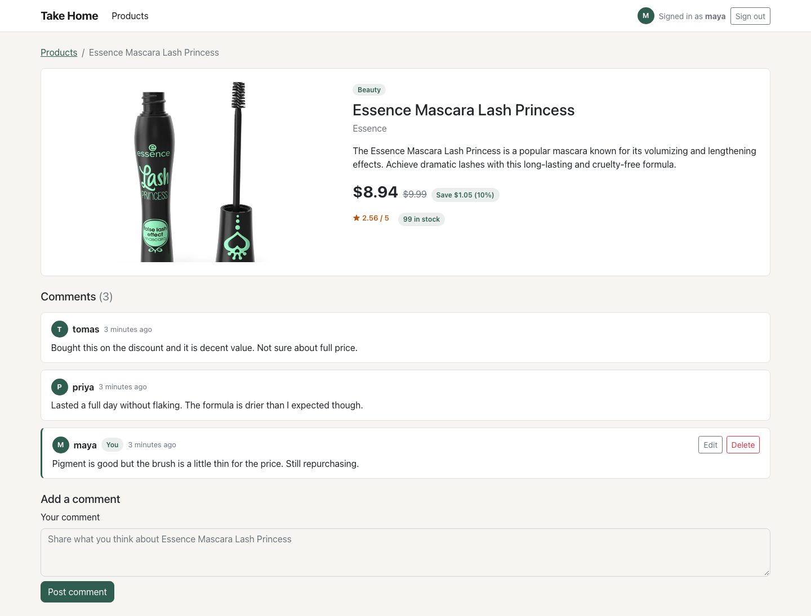
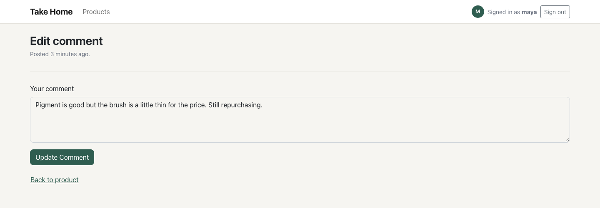
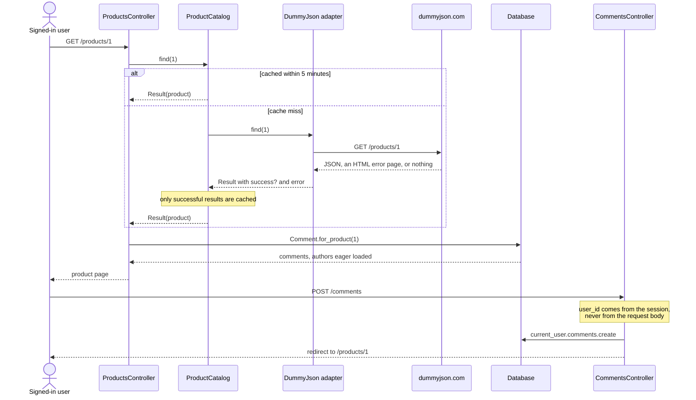

# Take-home — comments on an upstream product catalogue

A small Rails 7 app that lists products from the public
[dummyjson](https://dummyjson.com/docs/products) catalogue and lets signed-in
users leave, edit and delete comments on them. No product is ever stored
locally: the catalogue is fetched from the upstream API on demand and cached
for five minutes. Only `users` and `comments` exist in the database.

Sign-in is by username alone — no password, as the original brief specified.
An unknown username creates the account. Treat it as an identity stub, not as
authentication.

## What it looks like

| Catalogue | Product with comments |
| --- | --- |
|  |  |

Editing a comment you own — the Edit and Delete controls only render on your
own comments:



Captured with Playwright against the app running locally on `db:seed` data and
the live dummyjson API. The catalogue shot is 1440x900, the product page is a
full-page capture at 1440 wide, and the edit form is clipped to 1440x500 so it
is not mostly empty page.

## Run it

Development and test default to SQLite, so no database server is needed.

```bash
bundle install          # Ruby 3.1.x, see .ruby-version
cp .env.example .env

bin/rails db:prepare db:seed
bin/rails server
```

Open http://localhost:3000, type any username, and start commenting.

### Or with PostgreSQL, in Docker

```bash
cp .env.example .env
# set DATABASE_PASSWORD and SECRET_KEY_BASE (bin/rails secret) in .env
docker compose up --build
```

Compose has no fallback for either variable — `${DATABASE_PASSWORD:?...}`
means the stack refuses to start rather than boot on a known password. The
entrypoint runs `db:prepare` before Puma, and the image declares a
`HEALTHCHECK` against `/up`. The image has not been built here, so treat the
Docker path as reviewed-but-unbuilt.

## What happens when you open a product page



`ProductCatalog` is the port the controllers talk to. It owns the cache and
delegates to an adapter; only the adapter knows the upstream is dummyjson over
HTTParty. Nothing in `app/controllers` or `app/views` mentions HTTParty, JSON
or a URL. Swapping catalogues is `ProductCatalog.adapter = MyCatalog.new`, and
an adapter needs only `list(limit:)` and `find(id)` returning a
`ProductCatalog::Result` — which is how the suite runs with no network.

Every failure arrives in that one shape. `ResponseFormatter` turns a JSON body,
an HTML error page or an empty body into `success?` plus `errors`, and
`DummyJson::Base` converts timeouts, refused connections and SSL errors into
the same failure result. Controllers therefore have a single error branch and
no `rescue` clauses.

## Authorization is a scope, not a check

`CommentsController#set_comment` loads through `current_user.comments`, so
another user's comment is simply not found — there is no
`if comment.user_id == current_user.id` to forget at a new call site. `user_id`
is not in the permitted-parameter list either: it comes from the session via
`current_user.comments.new`. `update` permits only `:message`, so a comment
cannot be moved to another product.

`test/integration/comment_authorization_test.rb` pins the five ways this could
go wrong — opening another user's edit form, updating their comment, deleting
it, forging a comment as them, transferring one to them — plus the signed-out
case.

## The slow path was the comment list, not the API call

The product page renders each comment's author, so the association is eager
loaded in the model rather than at each call site:

```ruby
scope :for_product, lambda { |product_id|
  where(product_id:).includes(:user).order(created_at: :desc, id: :desc)
}
```

The last test in `test/integration/products_test.rb` subscribes to
`sql.active_record`, renders a product page carrying seven comments, and
asserts that queries touching `users` stay at two or fewer. Remove the
`includes(:user)` and it fails.

Migration `20230816120000_add_index_to_comments_product_id` adds
`(product_id, created_at)`, which matches both the filter and the sort — the
base schema indexed `comments.user_id` only, and nothing reads comments by user.

## Smaller decisions

- **Money is BigDecimal.** Upstream `price` is the list price and
  `discountPercentage` the reduction against it. `Product#discounted_price`
  computes in `BigDecimal`, against a table of six expected values in
  `test/models/product_test.rb` derived by hand rather than from the
  implementation.
- **The catalogue is cached, failures are not.** The product list is identical
  for every visitor, so successes are cached for five minutes and failures
  never are — an upstream blip must not be pinned for the whole TTL.
- **`Product` is a value object, not a record.** It compares by attributes and
  drops unknown upstream keys, so a new field appearing upstream cannot break
  construction. The `Result` and `ResponseFormatter` objects around it are
  frozen.
- **SQLite locally, PostgreSQL deployed.** `config/database.yml` picks the
  adapter from `DATABASE_ADAPTER` and reads every Postgres connection detail
  from the environment. `db/schema.rb` is kept in its PostgreSQL form.
- **`/up` is deliberately dumb.** It is unauthenticated and touches no
  database, so it reports whether the web process is serving, not whether the
  whole stack is well.

## Settings

Everything is optional for the SQLite path. `.env.example` lists the same set.

| Variable | Default | Notes |
| --- | --- | --- |
| `DUMMY_JSON_BASE_DOMAIN` | `https://dummyjson.com` | Base URL of the upstream catalogue. |
| `DATABASE_ADAPTER` | `sqlite3` | Set to `postgresql` to use PostgreSQL. |
| `DATABASE_HOST` / `PORT` / `NAME` / `USERNAME` | `localhost`, `5432`, `take_home_<env>`, `postgres` | Only read under PostgreSQL. Compose supplies its own values. |
| `DATABASE_PASSWORD` | none | Required by `docker compose`, which will not start without it. |
| `SECRET_KEY_BASE` | none | Required in production. Generate with `bin/rails secret`. |
| `RAILS_MAX_THREADS` | `5` | Puma threads and the Active Record pool size. |
| `WEB_PORT` | `3000` | Host port published by `docker compose`. |
| `RUN_DB_PREPARE` | `true` | Set `false` to skip `db:prepare` in the container entrypoint. |

## Where the code lives

```
app/services/
  product_catalog.rb            the port: list/find, caching, adapter swap
  dummy_json/base.rb            HTTP, timeouts, transport-error containment
  dummy_json/products.rb        the dummyjson adapter
  dummy_json/response_formatter.rb   one safe result shape for any response
app/models/
  user.rb                       case-insensitive username lookup, find-or-create
  comment.rb                    validations and the for_product scope
  product.rb                    non-persisted value object, discount arithmetic
app/controllers/                sessions, products, comments, health
app/views/                      ERB over Bootstrap 5 plus a small design layer
db/migrate/                     users, comments, comments(product_id, created_at)
test/                           integration and unit, Minitest with fixtures
```

## Tests

```bash
bin/rails test            # 72 runs, 163 assertions, 0 failures, 0 errors, 0 skips
bundle exec rubocop       # rubocop-rails + rubocop-minitest
```

Minitest with fixtures. Every outbound call is stubbed with WebMock under
`WebMock.disable_net_connect!(allow_localhost: false)`, so no test can reach
the network or depend on dummyjson being up. Coverage leans on the two places
this app can actually hurt: cross-user access on every mutating action, and
upstream responses that are not the happy path — a 404, a 500, an HTML body, an
empty body, a timeout, a refused connection.

## Known gaps

- **Sign-in is not authentication.** Any username grants access to that
  account. No password, no session expiry, no rate limiting. The brief asked
  for username-only identification and this was not extended past it.
- Products are read-only and entirely upstream. No local product table, no
  search, no filtering.
- The catalogue fetches a fixed 100 products in one request and renders all of
  them. No pagination, no infinite scroll. Comment lists are not paginated
  either.
- `Rails.cache` in production defaults to a per-process store, so a second web
  process keeps its own copy. A shared store would be needed before scaling out.
- No background jobs, no mail, no Action Cable. The generated stubs for those
  remain but are unused.
- Comment text is plain text, escaped on render. No formatting, no moderation,
  no spam protection.
