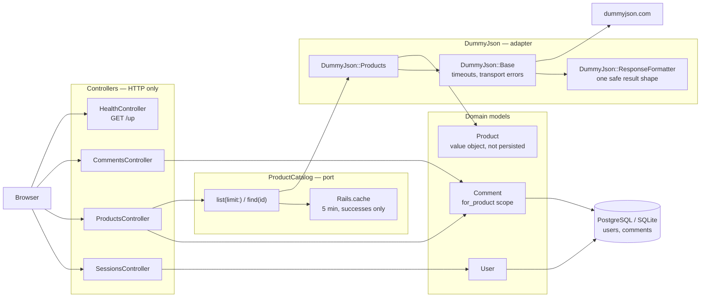
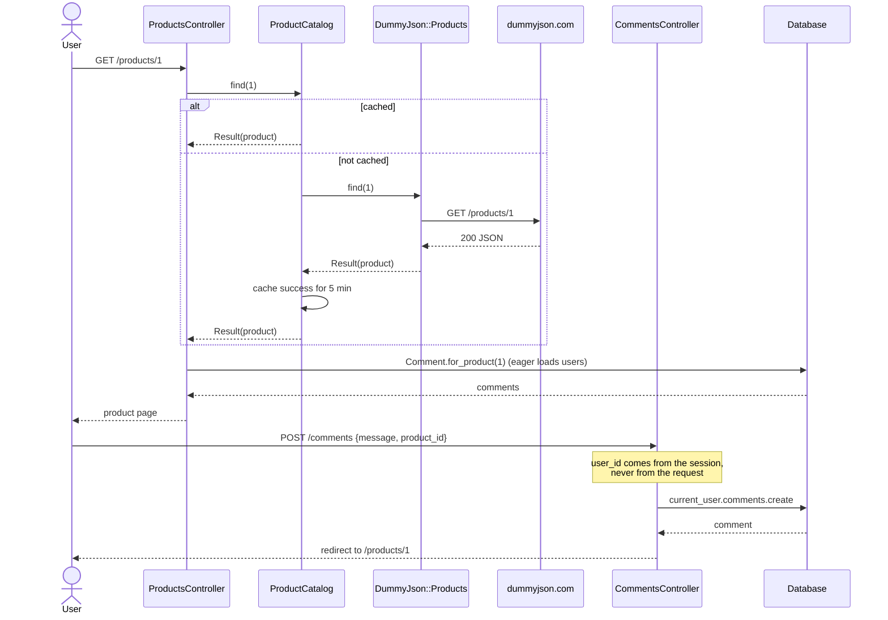

# Take Home Assignment — product comments

A small Rails application that lists products from the public
[dummyjson](https://dummyjson.com/docs/products) catalogue and lets signed-in
users leave, edit and delete comments on them. Products are never stored
locally — they are fetched from the upstream API on demand and cached; only
users and comments live in the database.

Sign-in is by username alone: there is no password, by design of the original
brief. Treat it as an identity stub, not authentication.

## Screenshots

| Product catalogue | Product detail with comments |
| --- | --- |
|  |  |

Editing a comment you own:


Captured with Playwright at 1440x900 against the app running locally on seeded
data and the live dummyjson API.

## Architecture



Dependencies point inward and in one direction: controllers depend on the
`ProductCatalog` port, the port depends on an adapter interface, and only the
adapter knows that the upstream happens to be dummyjson over HTTParty. Nothing
in `app/controllers` or `app/views` references HTTParty, JSON or a URL.

## Posting a comment



## Quickstart

No database server required — development and test default to SQLite.

```bash
git clone <repository-url>
cd take-home-assignment-the-room

# Ruby 3.1.x (see .ruby-version)
bundle install
cp .env.example .env

bin/rails db:prepare db:seed
bin/rails server
```

Open http://localhost:3000, enter any username, and start commenting.

### With Docker (PostgreSQL)

```bash
cp .env.example .env
# set DATABASE_PASSWORD and SECRET_KEY_BASE (bin/rails secret) in .env
docker compose up --build
```

The web container runs migrations on boot and exposes `/up` for its
healthcheck.

## Configuration

| Variable | Required | Default | Purpose |
| --- | --- | --- | --- |
| `DUMMY_JSON_BASE_DOMAIN` | no | `https://dummyjson.com` | Base URL of the upstream product API. |
| `DATABASE_ADAPTER` | no | `sqlite3` | Set to `postgresql` to use PostgreSQL instead of the local SQLite fallback. |
| `DATABASE_HOST` | no | `localhost` | PostgreSQL host. Ignored under SQLite. |
| `DATABASE_PORT` | no | `5432` | PostgreSQL port. Ignored under SQLite. |
| `DATABASE_NAME` | no | `take_home_<env>` | PostgreSQL database name. Ignored under SQLite. |
| `DATABASE_USERNAME` | no | `postgres` | PostgreSQL user. Ignored under SQLite. |
| `DATABASE_PASSWORD` | yes for Docker | — | PostgreSQL password. `docker compose` refuses to start without it. |
| `SECRET_KEY_BASE` | yes in production | — | Rails session/cookie signing key. Generate with `bin/rails secret`. |
| `RAILS_MAX_THREADS` | no | `5` | Puma threads and the Active Record connection pool size. |
| `WEB_PORT` | no | `3000` | Host port published by `docker compose`. |
| `RUN_DB_PREPARE` | no | `true` | Set to `false` to skip `db:prepare` in the container entrypoint. |

## Development

```bash
bin/rails server          # http://localhost:3000
bin/rails test            # full suite
bundle exec rubocop       # lint (rubocop-rails + rubocop-minitest)
bin/rails db:seed         # idempotent sample users and comments
```

The suite is Minitest with fixtures. Every outbound HTTP call is stubbed with
WebMock and `WebMock.disable_net_connect!`, so tests never touch the network
and never depend on dummyjson being up.

## Project structure

```
app/
  controllers/
    application_controller.rb   current_user, logged_in?, require_login
    comments_controller.rb      CRUD, scoped to the signed-in user
    products_controller.rb      catalogue listing and detail
    sessions_controller.rb      username-only sign in
    health_controller.rb        GET /up for the container healthcheck
  models/
    user.rb                     account; case-insensitive username lookup
    comment.rb                  validations and the for_product scope
    product.rb                  non-persisted value object; discount arithmetic
  services/
    product_catalog.rb          the port: list/find, caching, adapter swap
    dummy_json/
      base.rb                   HTTP, timeouts, transport-error containment
      products.rb               the dummyjson adapter
      response_formatter.rb     one safe result shape for any response
  views/                        ERB, Bootstrap 5 plus a small design layer
db/
  migrate/                      users, comments, comments(product_id, created_at)
  schema.rb                     PostgreSQL schema (the deployed adapter)
  seeds.rb                      idempotent sample data
test/
  integration/                  request-level tests, including authorization
  models/ services/             unit tests
docs/screenshots/               images used by this README
```

## Design notes

**Authorization is a scope, not a check.** `CommentsController#set_comment`
loads through `current_user.comments`, so another user's comment is simply not
found. There is no `if comment.user_id == current_user.id` to forget at a new
call site. `user_id` is never in the permitted-parameter list; it comes from the
session via `current_user.comments.new`. Before this, `Comment.find(params[:id])`
was unscoped and `user_id` was mass-assignable, so any signed-in user could edit
or delete anyone's comment, post a comment as someone else, and reassign an
existing comment to another account.

**One seam, at the boundary that matters.** The only thing about this app
plausibly worth swapping is where products come from. `ProductCatalog` is that
seam: `ProductCatalog.adapter = SomeOtherCatalog.new` is the whole change, and
an adapter needs only `list(limit:)` and `find(id)` returning a
`ProductCatalog::Result`. The test suite uses this to run without a network.

**Failure has one shape.** `ResponseFormatter` turns any response — JSON, an
HTML error page, an empty body — into `success?` plus `errors`, and
`DummyJson::Base` converts timeouts and refused connections into the same
failure result. Controllers therefore have one error branch and no rescue
clauses. Previously a bare `JSON.parse` in the constructor meant a non-JSON
response raised out of the service and returned a 500 rather than the error
message the controller was written to show.

**The real bottleneck was the comment list, not the API call.** The product
page renders each comment's author. With the association not eager loaded, a
page with seven comments issued eight queries against `users`; `Comment.for_product`
eager loads and that becomes one. Measured by counting `sql.active_record`
notifications in `test/integration/products_test.rb`, which fails if the
eager load is removed. The original schema also indexed only `comments.user_id`
while every read is by `product_id`, so a migration adds
`(product_id, created_at)` — matching both the filter and the sort.

**The catalogue is cached, failures are not.** The product list is identical for
every visitor and changes rarely, so `ProductCatalog` caches successful results
for five minutes. Failures are deliberately not cached, so an upstream blip is
not pinned for the whole TTL.

**Money is BigDecimal.** Upstream `price` is the list price and
`discountPercentage` the reduction against it. `Product#discounted_price`
computes in `BigDecimal` and is covered by a table of expected values derived
independently of the implementation.

**SQLite locally, PostgreSQL deployed.** `config/database.yml` selects the
adapter from `DATABASE_ADAPTER` so the project clones and runs with no database
server, while Docker and production use PostgreSQL. `db/schema.rb` is kept in
its PostgreSQL form; migrating against the local SQLite fallback deliberately
does not re-dump it.

## Limitations

- **Sign-in is not authentication.** Any username grants access to that account;
  there is no password, no session expiry and no rate limiting. The brief
  specified username-only identification and this has not been extended.
- Products are read-only and come entirely from dummyjson. There is no local
  product table, no search and no filtering.
- The catalogue endpoint fetches a fixed 100 products in one request and the
  page renders all of them; there is no pagination or infinite scroll.
- Comment lists are not paginated. With the eager load and the index this is
  fine at the scale a product page reaches here, but it is not unbounded-safe.
- `Rails.cache` is the configured store, so with the default in-memory store
  each process keeps its own copy. A shared store (Redis, Memcached) would be
  needed before running more than one web process.
- No background jobs, no email, no Action Cable channels; the generated stubs
  for these remain but are unused.
- Comment text is plain text only, escaped on render. There is no formatting,
  no moderation and no spam protection.
